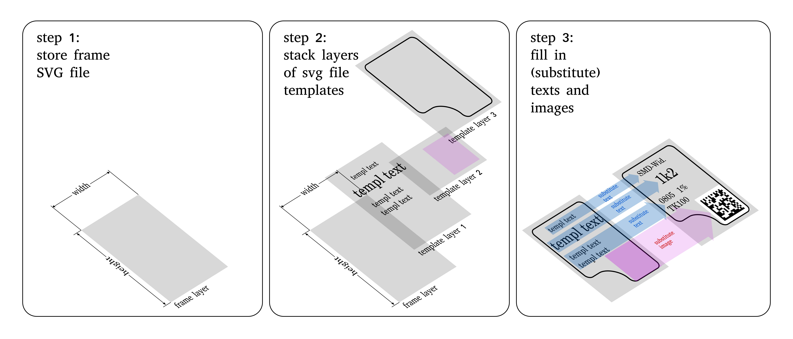

=========
schablone
=========

What it is?
-----------

schablone is a library to create structured printed formulars in svg format and fill them with information. Its main purpose is to create labels for boxes in a storage system (for instance your local hacker space). Beyond that it is flexible enough to create many other structured documents, like for example resumes or business cards. Schablone broadly exploits the flexibility the xml formats, especially svg. In future development also other xml formats like html might be deployed. It relies on the libraries svglue, svgutils and lxml (currently indirectly). Occasionally also the library Rsvg (gi.repository) is utilized.

What can I use it for?
----------------------

schablone is a very flexible library to create structured svg files. The user must specify -template layers- of svg files with fields of images and text to fill in. The library stacks these layers and fills in the wished texts and images. The library might, for instance, be used to automize the creation of address labels in a django based e-commerce system.

.. figure:: images/smd_container.png
   :scale: 30 %

The library also can be used for some special tasks like creating box labels or labels of smd containers (as seen in the image above).

.. - create some of the schablone templates like
    - image samples box label
    - image samples smd container
 
.. - also generic labels can be created 

.. - some more generic labels may follow
    - link resume
    - business cards

Why should I use it?
--------------------

schablone simplifies the process of automatically creating labels and fill them in. Whenever structured documents should be created and filled in by python, schablone is a good workflow. Also qr-codes can be created. The basic procedure is a three steps process:

1. `store frame SVG file which has the wished size`_
2. `stack layers of svg file templates`_
3. `fill in texts and images`_




Usage
-----

store frame SVG file which has the wished size
``````````````````````````````````````````````

tbc

stack layers of svg file templates
``````````````````````````````````

tbc

fill in texts and images 
````````````````````````

tbc

Examples
--------

Requirements
------------

It relies on the libraries 

* **svglue**, 
* **svgutils**
* and **lxml** (currently indirectly). 

Occasionally also the library **Rsvg** (gi.repository) is utilized. Installation using pip: ::

    $ pip install svglue svgutils lxml 

Installation
------------

::

    $ pip install schablone 

License
-------

todo 
